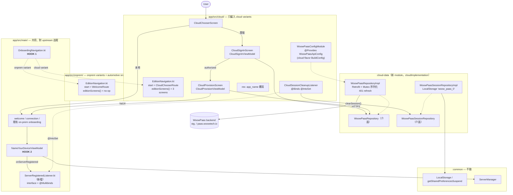

# PRD：以 build configuration 統一 on-premise 與 cloud 版本於單一 repo

- 日期：2026-08-23（同日依決策 refine）
- 狀態：**已決策，待執行**
- 相關 repo：
  - `WOOWTECH/woow_ha_app`（on-premise，本文所在 repo）
  - `WOOWTECH/woow_ha_app_cloud_vesion`（cloud fork，目標：歸併後封存）
- **移植來源（已凍結）**：`dev/cloud-onboarding-integrated` @ `893eae55`
  （2026-08-19，"docs(integration): end-to-end validation report for Eugene
  stack"）。此 SHA 之後若 cloud repo 再有新 commit，須另行 cherry-pick 並
  記錄，不自動納入本計畫。

## 0. 決策記錄（2026-08-23，Alan）

| # | 議題 | 決策 |
|---|---|---|
| D1 | 移植來源 | 以 `dev/cloud-onboarding-integrated`（`893eae55`）為唯一來源，非 cloud main |
| D2 | cloud edition 的 Firebase entry | **暫不存在，照 port 不動。** cloud repo 現況即無真實 Firebase 專案 entry、僅靠 mock google-services 通過建置；歸併後維持同樣狀態。已知後果：cloud edition 的 FCM 推播不可用——與 cloud repo 今日行為完全相同，不構成 regression。未來要上架或需要推播時再建 entry（列入 Phase 2） |
| D3 | `stg.woowtech.io` CF-Access | **維持 integrated 最新 commit 的現況**：debug→`stg.woowtech.io`、release→`paas.woowtech.io`（`59f126d4` 曾臨時把 debug 指向 prod，`d8114e38` 已 revert，revert 後狀態即為定案）。CF-Access 擋實機測試的問題不在本計畫內處理 |
| D4 | cloud 功能是否重構 | **不重構，照 port**（2026-08-24 architect review 結論，見 §2.3 架構品質列）。僅做移植機制本身強制的搬移；明確否決 UseCase 抽取、Repository 拆分、MVI 化、DataStore 遷移等任何「順手改善」 |
| D5 | variant 矩陣規模（2026-08-24 party review，Winston 提議砍 `minimalCloud` 降為 6） | **保留 8 個 variant。** 理由：repo 為 public，GitHub Actions 免費（已核實），CI 成本論不成立；保留對稱矩陣的未來彈性。Winston 的「minimalCloud 無消費者」觀察屬實，記錄於此供未來重議 |
| D7 | 自動化測試範圍（2026-08-26） | **三層全做、全自動**（Layer 1 單元／Layer 2 假 PaaS 儀器／Layer 3 真 server E2E），但每層只放該層獨有價值的必要測試，下層已蓋的情境不上移。詳見 §10；Layer 3 受外部前置 P1–P3 約束 |
| D6 | `:cloud-data` module 存廢（party review，Winston 主張改放 `app/src/cloud/`） | **保留 module。** Winston 對兩條原始論證的反駁屬實（lockfile 因 dimension 改名無論如何整檔重寫；`app/build.gradle.kts` 因 plugin alias 無論如何要改），但模組邊界的長期價值（未來第二個消費者、依賴封裝）由決策者拍板保留。代價照實記帳：`settings.gradle.kts` +1 行、`:cloud-data/gradle.lockfile` 需產生並 commit、風險 #8 |

---

## 1. 背景與現況

兩個 repo 的實際拓撲（2026-08-23 調查結果，非推測）：

```
home-assistant/android (upstream)
        │
woow_ha_app main ─── 5756ca6d (目前 tip)
        │                │
        │                └── cloud repo 的 merge-base 就是 5756ca6d
        │
cloud repo main ──── 5756ca6d + 17 commits（29 檔，+2,899/−5）
        │
dev/cloud-onboarding-integrated ── cloud main + 20 commits
                                   （對 woow main 總計 146 檔，+6,536/−21）
```

三個決定性的事實：

1. **兩個 repo 還沒有真正岔開。** cloud repo 在 `dbae4995` merge 了
   `woowtech/main`，而且 merge 進來的正是 woow_ha_app main 的**目前 tip**。
   merge-base = tip 代表現在歸併是**近乎零衝突**的；woow main 每前進一個
   commit，這個窗口就關小一點。
2. **移植對象是 `dev/cloud-onboarding-integrated`，不是 cloud main。**
   integrated 分支包含 cloud main 全部內容（behind 0），且品質遠高於 main：
   WoowPaas 已重構為 `:common` 下的 Repository pattern（Retrofit +
   kotlinx.serialization + Hilt `@Binds`）、token 持久化與 401 自動
   refresh、返回導覽修正、完整測試（含 949 行的 `WoowPaasRepositoryImplTest`）、
   2026-08-19 的端到端驗證報告。
3. **Cloud 功能的 UI 入口就是一個畫面。** `CloudChooserScreen`（「選擇連線
   方式」：連結本地設備／使用雲端服務）取代 `WelcomeRoute` 成為 onboarding
   起點。選「本地」走回既有 on-prem 流程 —— 也就是說 **cloud 版是 on-prem
   版的嚴格超集**，這使得「用設定隱藏」在架構上是乾淨的。

## 2. 功能差異表

### 2.1 使用者可見差異

| 面向 | on-premise（woow_ha_app） | cloud（integrated 分支） |
|---|---|---|
| App 名稱 | woowtech Home | woowtech Home Cloud／雲端版 |
| applicationId | `com.woowtech.home` | `com.woowtech.homecloud` |
| Onboarding 起點 | Welcome 畫面 | **CloudChooser**（選擇連線方式） |
| 雲端登入 | 無 | CloudSignIn：OAuth 2.0 Device Flow（user code 授權） |
| 雲端開通 | 無 | CloudProvision：呼叫 WoowPaas 開通 HA 實例並輪詢狀態 |
| 本地連線流程 | 完整 | 完整（chooser 選「本地」後相同） |
| 其餘所有畫面 | — | **完全相同**（sensor、widget、Wear、Automotive…） |
| 語系 | 依系統（en＋zh-TW） | cloud 三畫面**僅繁中**——文案硬編、未用字串資源（見 §2.3 衛生問題 2、follow-up F1） |

### 2.2 技術差異

| 面向 | on-premise | cloud（integrated） |
|---|---|---|
| 資料層 | — | `common/…/data/woowpaas/`：Repository、Service、DTO、TokenErrorClassifier、Session 持久化＋401 refresh |
| UI 層 | — | `app/…/onboarding/cloudchooser|cloudsignin|cloudprovision/`（3 畫面＋navigation） |
| 導覽接線 | `startDestination = WelcomeRoute` | `startDestination = CloudChooserRoute` ＋ 3 個 cloud screen 注冊 |
| 環境設定 | — | `buildConfigField`：debug→`stg.woowtech.io`，release→`paas.woowtech.io` |
| 測試 | — | unit＋navigation＋screenshot 全覆蓋（約 1,900 行測試碼） |
| CI | pr.yml（本 repo 版本） | 另加 `dev-build.yml`（dev/** 自動出 debug APK） |
| 版本推導 | reckon（正常） | **settings.gradle.kts 整段 bypass reckon、硬編版本**（分支上的臨時 hack，作者自註「merge 前必須處理」） |
| 雜項 | — | 誤 commit 的 `.superpowers/brainstorm/` pid 檔；`IgnoreViolationRules.kt` 加了 file-level lint 抑制（與本 repo「該檔與 upstream byte-identical」的紀律衝突，本 repo已用 automotive lint-baseline 解決同一問題） |

### 2.3 Lint 與程式碼品質實測（2026-08-24，integrated @ 893eae55）

「上一個 developer 沒跑 lint」的印象經實測**大部分不成立**——移植來源的
lint 是綠的，但有三個衛生問題要在移植時處理：

| 檢查 | 實測結果 |
|---|---|
| `ktlintCheck`（全模組） | ✅ BUILD SUCCESSFUL |
| `./gradlew lint --continue` | ✅ 四模組全部 "no new issues" |
| lint-baseline 是否被灌大 | ✅ 未灌大——app（283）與 automotive（434）的 baseline 與本 repo main **完全相同** |
| 衛生問題 1 | `IgnoreViolationRules.kt` 用 file-level `@Suppress` 壓 ObsoleteSdkInt（cloud main `2b96f62a`）——錯誤手法：本 repo 已用 automotive baseline 解決同一問題，且該檔必須與 upstream byte-identical。**移植時捨棄**（§6 步驟 4 已列） |
| 衛生問題 2 | cloud 功能全部 UI 文案**硬編繁中字串**，且部分在資料層產生（`TokenErrorClassifier`、`WoowPaasRepositoryImpl` 直接輸出「登入已過期…」等顯示字串；兩個 Screen 未用 `stringResource`）。違反 CLAUDE.md 字串資源規則。**列為 follow-up F1，不在移植中修**：影響 13 檔＋大量測試斷言，全部是 cloud-only 檔案、零 upstream rebase 成本，不值得在 merge window 內處理。副作用：§2.1 的「其餘畫面完全相同」須加註——cloud 三畫面目前實質上只有繁中 |
| 衛生問題 3 | 兩處中文程式註解（`WoowPaasConfig.kt`、convention plugin）違反「code in English」——移植 PR 內順手翻譯，成本兩行 |
| 架構品質 | Repository/Hilt/ViewModel/併發處理**全面符合本 repo 慣例**，部分（`CancellationException` 處理、Mutex 序列化 refresh、KDoc why-not-what）優於現有平均水準。**無重構必要**（D4） |

## 3. 目標與非目標

**目標**

1. 單一 repo 同時產出 on-premise 與 cloud 兩種 APK，以 build configuration 區隔。
2. on-premise APK **不含** cloud 程式碼與 PaaS 端點（不只是隱藏入口）。
3. 兩個既有 applicationId（`com.woowtech.home`、`com.woowtech.homecloud`）
   都保留，已安裝用戶可持續升級。
4. 保持本 repo 的 upstream 同步紀律（`docs/fork-divergence.md`）：`:common`
   與 `IgnoreViolationRules.kt` 不因此增加 divergence。
5. cloud repo 歸併後封存（read-only），此後只維護一份程式碼。

**非目標**

- 不做 runtime 遠端開關（remote config 動態開關 cloud 入口）。identity
  （applicationId／app 名稱）本質上是 build-time 的，單一 APK 雙身份不可行；
  cloud 版內部的 runtime 開關可作為未來擴充，不在本次範圍。
- 不改動 cloud onboarding 的功能行為（integrated 分支照搬，行為問題另開 issue）。
- Wear 與 Automotive 不出 cloud 版。

## 4. 方案評估

| 方案 | 說明 | 評估 |
|---|---|---|
| A. 維持兩個 repo | 現狀 | ❌ 每次 upstream/on-prem 更新都要人工雙向搬運；merge window 一過，成本隨時間單調上升。這正是要解決的問題 |
| B. 單一 repo＋runtime flag | 一個 APK，設定隱藏入口 | ❌ applicationId／app_name 無法 runtime 切換；on-prem APK 仍打包 PaaS 端點與 OAuth 流程（on-premise 客戶通常有安全審查，dead cloud code 是負債）；Google Play 也視為同一 app |
| **C. 單一 repo＋flavor dimension** | 新增 `edition` 維度：`onprem`／`cloud` | ✅ 與現有 `full`/`minimal` 維度同一套機制（團隊已熟悉）；identity、資源、程式碼、設定全部隨 variant 切換；on-prem APK 物理排除 cloud 碼 |

**選 C。** 使用者要求的「configuration 區隔」在 Android 生態的標準解法即
product flavor；本 repo 已有 `version` 維度（`full`/`minimal`）證明此模式可行。

## 5. 建議設計

### 5.1 Flavor 矩陣

`:app` 新增 dimension `edition`。**必須放在新的、只給 `:app` 用的 convention
plugin**——現有 `AndroidFullMinimalFlavorConventionPlugin` 同時被
`automotive/build.gradle.kts` 套用，改它會讓 automotive 也長出 edition 維度
（architect review S-2，此處為定案而非選項）：

```kotlin
// 新檔：AndroidEditionFlavorConventionPlugin.kt，僅 app/build.gradle.kts 套用
flavorDimensions += listOf("version", "edition")
productFlavors {
    create("onprem") {
        dimension = "edition"
        // applicationId 沿用 defaultConfig 的 com.woowtech.home
    }
    create("cloud") {
        dimension = "edition"
        applicationId = "com.woowtech.homecloud"
        // 端點值依 D3 沿用 integrated 分支現況：
        //   debug   → https://stg.woowtech.io
        //   release → https://paas.woowtech.io
        buildConfigField("String", "WOOW_PAAS_BASE_URL", …)
        buildConfigField("String", "WOOW_PAAS_CLIENT_ID", "\"woow-ha-app\"")
        buildConfigField("String", "WOOW_PAAS_SCOPES", …)
    }
}
```

> 實作注意：flavor block 內無法依 buildType 給不同值。debug/stg 與
> release/prod 的分歧須用 `androidComponents.onVariants { }` 在
> variant 層組合（`flavorName == "cloud"` 且依 `buildType` 選值），或沿用
> integrated 分支「值設在 buildType block」的做法但改為只在 cloud variant
> 注入。onprem variant **不產生任何 WOOW_PAAS 欄位**——`:cloud-data` 不在
> 其 classpath 上，也不應留下端點字串。

產生的 `:app` variants（8 個）：

| variant | applicationId |
|---|---|
| fullOnpremDebug | com.woowtech.home.debug |
| fullOnpremRelease | com.woowtech.home |
| minimalOnpremDebug | com.woowtech.home.minimal.debug |
| minimalOnpremRelease | com.woowtech.home.minimal |
| fullCloudDebug | com.woowtech.homecloud.debug |
| fullCloudRelease | com.woowtech.homecloud |
| minimalCloudDebug | com.woowtech.homecloud.minimal.debug |
| minimalCloudRelease | com.woowtech.homecloud.minimal |

`:wear`、`:automotive` **不加** edition 維度，且**不需要**
`missingDimensionStrategy`——已驗證 repo 內沒有任何模組依賴 `project(":app")`，
該設定是多餘的（architect review S-1，比原稿再省一個 upstream 檔案改動）。

automotive 以 `srcDirs("../app/src/main/kotlin")` 共用原始碼，cloud 檔案在
`app/src/cloud/` 下自然不被編入——此半句成立；但 **onprem hook 不是免費的**：
`OnboardingNavigation.kt`（在 src/main）呼叫 `editionStartDestination()`，其
onprem 實作在 `app/src/onprem/`，automotive 的 srcDirs 沒接這個目錄會編譯失敗。
須在 `automotive/build.gradle.kts` 的 main srcDirs 加一行
`"../app/src/onprem/kotlin"`（+1 upstream 檔案改動，誠實記帳）。

### 5.2 程式碼放置

| 內容 | 位置 | 理由 |
|---|---|---|
| Cloud 3 畫面＋ViewModel＋navigation | `app/src/cloud/kotlin/…`（自 `app/src/main` 平移） | 只有 cloud variant 編譯 |
| WoowPaas 資料層（integrated 分支放在 `:common`） | **新 Gradle module `:cloud-data`**，以 `"cloudImplementation"(project(":cloud-data"))` 掛入 | 見下方「為什麼是 module 而不是 `app/src/cloud/`」 |
| cloud 版 app_name 覆寫 | `app/src/cloud/res/values*/strings.xml` | app module 資源覆寫 library 資源；`:common` 的 strings.xml **不動**（cloud repo 直接改了 `:common`，歸併時改用此法） |
| unit 測試 | `app/src/testCloud/`、`:cloud-data/src/test/` | 隨 variant 執行 |
| screenshot 測試**原始碼** | cloud 三畫面的 screenshot test 目前在 variant 無關的 `app/src/screenshotTest/`——留在原地會讓 **onprem** variant 編譯失敗（引用不存在的 `CloudChooserScreen`）。須移入 cloud-scoped screenshot source set；**執行 Phase 0 前先驗證 AGP screenshot plugin 支援 flavor-scoped source set**，不支援則 cloud screenshot 測試改列 F1 隨字串資源化一併重做（architect review R7） |

**為什麼是 module 而不是 `app/src/cloud/`**（原稿理由不充分，architect review
修正）：把資料層放 `app/src/cloud/` 同樣能保住 `:common` 與 on-prem 排除，
機制還更少。module 真正站得住的理由有二——(1) **測試隔離**：949 行的
MockWebServer 測試套件在 `:cloud-data/src/test` 只跑一次；放
`app/src/testCloud/` 會在 variant 矩陣中重複執行。(2) **依賴範圍**：impl 需要
`retrofit-converter-kotlinx-serialization` 與 `OkHttpClient` 直接依賴，走
`app/src/cloud/` 就得改 upstream 的 `app/build.gradle.kts` 並永久污染
`app/gradle.lockfile`；module 把這些關進一行 `cloudImplementation`。已接受的
代價：`Clock` 與 `WoowPaasApiConfig` 由 `:app` 提供，`:cloud-data` 的 Hilt
graph 只在 app 層閉合，其自身測試直接 new impl（現有測試即如此，遷移時確認）。

### 5.3 兩個 hook（動到 main source set 的全部位置）

移植後 upstream 檔案的改動收斂為兩個 hook＋一行 srcDirs，其餘全部是新檔案
（新檔案在 rebase 時永不衝突）：

| Hook | upstream 檔案 | diff 量 | 機制 |
|---|---|---|---|
| 1. 導覽閘門 | `OnboardingNavigation.kt` | 約 5 行（原 cloud 改法 +19） | 見下 |
| 2. 註冊後清除 cloud session | `NameYourDeviceViewModel.kt` | 約 5 行（原 cloud 改法 +26） | Hilt `@Multibinds Set<ServerRegisteredListener>`，見下 |
| — | `automotive/build.gradle.kts` | +1 行 srcDirs | §5.1 已述 |

**Hook 2 的設計**（architect review 選定，取代 cloud repo 的直接注入）：
integrated 分支讓 `NameYourDeviceViewModel` 直接注入
`WoowPaasSessionRepository` 並於伺服器註冊成功後 `clearSession()`（PaaS 憑證
只為取得雲端實例位址而存在，註冊完成即無用，留著是無人讀取的憑證）。直接注入
在統一 repo 內無法編譯——onprem 的 classpath 上沒有 `:cloud-data`。解法：

```kotlin
// 新檔 app/src/main/…/onboarding/ServerRegisteredListener.kt（新檔不衝突）
fun interface ServerRegisteredListener { suspend fun onServerRegistered() }
// + @Multibinds abstract fun listeners(): Set<ServerRegisteredListener>

// NameYourDeviceViewModel.kt（upstream 檔）僅加：注入 Set + 註冊成功後 forEach
// app/src/cloud/…/CloudSessionCleanupListener.kt：@Binds @IntoSet，
//   持有 clearSession() 呼叫與 IOException 處理（原 +26 行中的 20 行 KDoc 隨遷）
```

**呼叫點語意必須逐字保留**（party review Amelia 查證 integrated 現行行為）：
`forEach` 必須放在原 `discardCloudSession()` 的**同一位置**——try 區塊內、
`serverManager.activateServer(serverId)` 之後、`return serverId` 之前，
**同步 await**。三要素缺一即行為變更：(a) navigation event 發出前完成；
(b) `IOException` 在 listener 內吞掉（不影響註冊結果）；(c) 其他例外向外
傳播、觸發既有的 revokeSession＋removeServer 註冊回滾。

否決的替代案：(b) no-op binding——需要讓 onprem 看得見 cloud 介面，違反
`:common` 不動或 cloud 型別出 main 的原則；(c) 改在 CloudProvision 交棒時清除
——是行為變更（使用者從 NameYourDevice 退回重試會被迫重新登入），§3 禁止。
Multibinding 空集合對 automotive 也天然成立，不需任何額外綁定。

#### 導覽閘門（Hook 1）

`OnboardingNavigation.kt` 不直接引用 cloud 類別，改為 edition 提供的 hook——
兩個 source set 各給一份實作：

```kotlin
// app/src/main — OnboardingNavigation.kt 僅呼叫：
val startDestination = when {
    !skipWelcome -> editionStartDestination()        // hook 1
    …
}
navigation<OnboardingRoute>(startDestination = startDestination) {
    editionScreens(navController)                    // hook 2
    welcomeScreen(…)
    …
}

// app/src/onprem/kotlin/…/EditionNavigation.kt
internal fun editionStartDestination(): Any = WelcomeRoute
internal fun NavGraphBuilder.editionScreens(nav: NavController) { /* no-op */ }

// app/src/cloud/kotlin/…/EditionNavigation.kt
internal fun editionStartDestination(): Any = CloudChooserRoute
internal fun NavGraphBuilder.editionScreens(nav: NavController) {
    cloudChooserScreen(onLocalClick = { nav.navigateToWelcome() }, …)
    cloudSignInScreen(…)   // 接線必須逐字取 integrated post-cc0b85e3 版本：
    cloudProvisionScreen(…) // onAuthorized = nav::navigateToCloudProvisionAfterSignIn
}                           // （popUpTo<CloudSignInRoute>{inclusive=true}，返回鍵死路修正）
```

main source set 對 upstream 的 diff 從 28 行縮到約 5 行，編譯期即保證
on-prem 不含 cloud 引用（不是 if-flag，是根本不存在）。`Any` 回傳型別經
party review 確認不是 smell——Navigation Compose 該參數的框架簽名就是
`Any`，現狀 `when` 的推導型別亦然；勿為此加型別包裝。

### 5.4 周邊設定

- `.github/mock-google-services.json`：integrated 分支**已含全部 8 個
  package_name**（home × 4、homecloud × 4），直接取其版本即可；注意其中
  `com.woowtech.home` 區塊重複出現兩次，取用時去重。依 D2，cloud edition
  僅靠此 mock 建置，不建真實 Firebase entry。
- **CI 改名完整清單**（party review Murat 逐檔核對，取代原稿的不完整版本）：

  | 檔案:行 | 現值 | 處置 |
  |---|---|---|
  | `pr.yml:227` | `:app:testFullDebugUnitTest` | → `…FullOnpremDebug…`，並補 `:app:testFullCloudDebugUnitTest` |
  | `pr.yml:250,255` | `:app:connectedFullDebugAndroidTest`、`:app:connectedMinimalDebugAndroidTest` 各 2 處 | → onprem 名稱。**automotive 的 2 處（260,266）不動**——原稿誤列 |
  | `pr.yml:118`、`updateScreenshot.yml:27` | `validateFullDebugScreenshotTest`／`update…`（**無 project 前綴**） | **必須改為 project-qualified**。陷阱：automotive 也套 screenshot convention，`:app` 改名後**同名 task 仍存在於 automotive**——Gradle 不報錯、只跑 automotive 那份然後回綠，257 張基準圖的驗證**靜默停跑**。這是「綠著壞掉」級的 gate 掏空 |
  | `onPush.yml:110` | `appDistributionUploadFullRelease` | → onprem 名稱。**原稿整個漏掉 onPush.yml**——port PR 全綠 merge 後，下一次 weekly release 才爆 |
  | `onPush.yml:179` | `:app:bundleFullRelease` | 同上 |
  | `onPush.yml:69`、`pr.yml:211` | aggregate `assembleRelease` | cloud release 會**自動**落入：R8 從 2 次變 4 次擠同一個 `-Xmx4g` daemon（該 job 現在就偶發 OOM），且 weekly 會默默用正式 keystore 簽 cloud release。**改為顯式列舉 onprem variants**；cloud release 建置留到 Phase 2（與 D2 一致——沒有 Firebase entry 的 cloud release 本來就不可發佈） |

- **Instrumentation 政策（明文決策，非默認）**：emulator matrix 只跑
  onprem——cloud repo 未新增任何 androidTest（已核實），cloud lane 待
  Phase 2 有需求再開。
- **Screenshot 基準圖平台紀律**：port 完成後必須在 branch 上以
  `updateScreenshot.yml`（ubuntu-latest）**重產全部基準圖**——cloud 的 78 張
  是 2026-08-17 本機（macOS）產的，本 repo 歷史已證明 macOS/Linux 的 tablet
  渲染會分岔；既有 2 張 CI 產的 ServerDiscovery tablet goldens **只能搬移、
  不准本機重產**。AGP sourceSets 驗證（風險 #2）須同時涵蓋「cloud variant
  與 onprem 共用同一份 reference 目錄」，否則 257 張要複製兩份。
- cloud repo 的 `dev-build.yml` 改造為以 variant 參數觸發後帶入本 repo（或
  棄用，統一走 pr.yml artifact）。

### 5.5 `BuildConfig.FLAVOR` 相容性（party review 發現的 blocking，必修）

`app/src/main` 有 **19 處** `BuildConfig.FLAVOR == "full"` 式的字串比對。加入
第二個 dimension 後 AGP 的 `FLAVOR` 變成組合名（`"fullOnprem"`），19 處在
全部 variant 一律變 false——**full 版靜默降級成 minimal 行為**：
`ApplicationModule.kt:52` 的 `@LocationTrackingSupport` 恆 false（位置追蹤
整個失效、onboarding 的 location sharing 畫面消失）、`WebsocketManager.kt:56`
websocket 預設由 NEVER 變 ALWAYS（常駐連線／耗電）、`SettingsFragment`／
`DeveloperSettingsFragment`／`CarSensorManager`／`LaunchViewModel`／
`WebViewPresenterImpl` 等設定顯隱與行為錯亂。這是「會改壞既有功能」的
第一號風險，原稿完全沒看到。

**修法**（不能用 `FLAVOR_version`——automotive 維持單維度，AGP 不會為它產生
該欄位，直接編譯失敗）：在**共用的** `AndroidFullMinimalFlavorConventionPlugin`
（app 與 automotive 都套用）為兩個 version flavor 各注入
`buildConfigField("Boolean", "IS_FULL", …)`，再把 19 個呼叫點機械式改為
`BuildConfig.IS_FULL`。附帶效果：順手償還 upstream 的「Never use strings for
logic」技術債。這 19 處全是 upstream 檔案的單行修改——已計入 §8.6 的誠實
記帳；rebase 時若 upstream 新增第 20 處比對，會以編譯或行為驗收（§8）攔截。

### 5.6 移植後架構圖（component level）



讀圖要點：cloud 功能對既有程式的接觸面**只有兩個 hook**；資料流向單向
（UI→Repository→backend）；`:common` 零改動；onprem variant 中整個
`CLOUDSRC` 與 `CDATA` 區塊物理上不存在。

## 6. 遷移計畫

**Phase 0 — 歸併（趁 merge window 開著，建議一週內）**

1. 本 repo 開 `feature/cloud-edition` 分支。
2. 建 `edition` flavor 骨架＋no-op hook（先讓 8 個 variant 都能編譯，
   onprem 與現狀**行為等價**——「bit-for-bit」字面上不可能：BuildConfig 必然
   新增 `FLAVOR_edition` 等欄位；等價性以 §8.1 的抽查清單驗證）。
3. 從 cloud repo `dev/cloud-onboarding-integrated` @ `893eae55` 移植（依 D1）：
   - UI 檔平移到 `app/src/cloud/`；
   - `:common/data/woowpaas` 平移到新 module `:cloud-data`（package 名可保留）；
   - 測試隨遷。
4. 刻意**不**帶過來的東西（每項都要在 PR 說明記錄）：
   - `settings.gradle.kts` 的 reckon bypass（作者自註 merge 前必須處理；
     歸併後 cloud 版本號自然由本 repo 的 reckon 管理，該 hack 失去存在理由）；
   - `.superpowers/brainstorm/` pid 垃圾檔；
   - `IgnoreViolationRules.kt` 的 file-level 抑制（本 repo 已用 automotive
     lint-baseline 解決同一 lint 問題，該檔維持與 upstream byte-identical）；
   - `:common` strings.xml 的 app_name 改動（改用 5.2 的資源覆寫）；
   - `AndroidApplicationConventionPlugin.kt` 對 `APPLICATION_ID` 常數的
     **替換**（cloud repo 是改值不是加值；統一後 defaultConfig 保持
     `com.woowtech.home`，cloud 由 flavor 覆寫——照抄該 hunk 會讓 onprem
     也變成 homecloud）。
5. 移植中必須同步修的既有機制（architect＋party review 發現）：
   - **`BuildConfig.IS_FULL` 注入＋19 個呼叫點改寫**（§5.5，blocking）；
   - **`APPLICATION_IDS` 產生器重寫**。party review 修正原稿規格：不是
     「笛卡兒積」——今天 onprem 的值是**恰好 2 筆** `{home, home.minimal}`，
     塞 4 筆等於把 homecloud id 放進 onprem APK 並改變 NFC NDEF 內容（本身
     就是行為變更）。正確規格：**每 edition 各 2 筆、per-variant 注入**
     （defaultConfig 是全 variant 共用、做不到 per-edition；且產生器在
     plugin apply 時走訪 flavors，晚註冊的 edition flavor 看不到——必須
     改到 `onVariants` 層）。另注意 onprem/cloud flavor 無
     `applicationIdSuffix` 時 `${it.applicationIdSuffix}` 會插值出字面
     `"null"`；
   - 產生並 commit `:cloud-data/gradle.lockfile`（漏了它 lockfiles job
     第一輪就紅）；
   - 兩處中文程式註解翻成英文（§2.3 衛生問題 3）；
   - screenshot reference 目錄與 CI task 更名（§5.4 完整清單＋§7 風險 #2
     的 AGP sourceSets 驗證）；
   - port 後在 branch 上跑 `updateScreenshot.yml` 重產全部基準圖
     （§5.4 平台紀律）。
6. 驗證閘門（見 §8）。
7. Merge 進 main。

**Phase 1 — 收斂**

7. cloud repo 設為 archived（read-only），README 指向本 repo。
8. cloud 團隊的未合分支（若有）限期遷移。
9. `docs/fork-divergence.md` 更新：記錄 edition 機制與 `:cloud-data` module。

**Phase 2 —（可選）發佈管線**

10. release workflow 增加 cloud variant 的簽章與發佈通道。
11. 為 `com.woowtech.homecloud` 建立真實 Firebase entry，解除 D2 的
    FCM 限制（屆時以真實 google-services.json 取代 mock 的 homecloud 區塊）。

## 7. 風險與開放問題

（原開放問題 #2 Firebase、#4 CF-Access 已由 §0 決策 D2、D3 關閉；
2026-08-24 依 architect review 增補 #2、#6～#8。）

| # | 風險／問題 | 處置 |
|---|---|---|
| 1 | **Merge window 正在關閉**：woow main 每前進，歸併衝突面積就增大 | Phase 0 排最高優先；期間 cloud repo 凍結新功能 |
| 2 | **Screenshot reference 更名是最大隱藏成本**：`app/src/screenshotTestFullDebug/reference/` 下 257 張 PNG，variant 更名後路徑全變 `…FullOnpremDebug…`；且 upstream 每次新增基準圖都落在舊路徑，**每次 rebase 都要重導一次** | Phase 0 前置驗證：AGP `android.sourceSets` 能否把 screenshot reference 目錄重新對映到舊路徑——可行則風險化為幾行 build 設定；不可行則明列進 `docs/fork-divergence.md` 作為永久 rebase 負擔並記入工時 |
| 3 | CI task 更名（完整清單見 §5.4 表格，含原稿漏掉的 `onPush.yml` 兩處——漏修的後果是 **port PR 全綠、下一次 weekly release 爆**） | 全列入 Phase 0 checklist；pr.yml 先只對 `fullOnprem`＋`fullCloud` 跑完整測試，minimal 維持 build-only |
| 4 | 兩位維護者對「哪些 cloud 行為是最終版」可能有分歧 | 依 D1 以 integrated 為準；歧異列入 PR review 由 cloud 功能作者確認 |
| 5 | cloud edition FCM 不可用（D2 的已知後果） | 已接受；Phase 2 建 Firebase entry 時解除。移植時確認 cloud onboarding 無硬依賴 FCM 的路徑 |
| 6 | `app/gradle.lockfile` 整檔重寫。**歸因修正**（party review）：肇因是 edition dimension 使全部 configuration 改名（674 行每行內嵌 configuration 名），與 `:cloud-data` 無關、任何方案下都發生；upstream 每次依賴更新都會衝突 | 無法避免，接受並記入 `docs/fork-divergence.md`；衝突解法固定為「重跑 `alldependencies --write-locks`」 |
| 7 | `gradle/libs.versions.toml` 不會完全回到 upstream 狀態（`mockwebserver` 條目＋edition plugin alias） | 接受；§8 驗收條款措辭已對應修正 |
| 8 | `:cloud-data` Hilt graph 不在模組內閉合（`Clock`、`WoowPaasApiConfig` 由 `:app` 提供） | D6 保留 module 的已知代價；其測試直接建構 impl（現況即如此），遷移時確認無測試依賴 Hilt |
| 9 | **Screenshot gate 靜默掏空**：無 project 前綴的 `validateFullDebugScreenshotTest` 在 `:app` 改名後會被 automotive 的同名 task 遮蔽——CI 綠、但 257 張基準圖沒在驗 | §5.4 表格：一律改 project-qualified；驗收 §8 加對應條款 |
| 10 | cloud 78 張基準圖產自本機 macOS，與 CI 的 Linux renderer 可能分岔（本 repo 歷史已發生過） | §5.4 平台紀律：port 後在 ubuntu-latest 重產全部；CI 產的 2 張只搬不重產 |

## 8. 驗收標準

1. `./gradlew :app:assembleFullOnpremDebug`：與現狀 `assembleFullDebug`
   **行為等價**（「dex 等價」字面上不可能——BuildConfig 欄位必然改變）。
   抽查清單：(a) `apkanalyzer` 查 `woowpaas`、`cloudchooser` 類別 0 筆；
   (b) APK 內無 PaaS 端點字串（`stg.woowtech.io`／`paas.woowtech.io` 0 筆）；
   (c) **`BuildConfig.IS_FULL` 行為驗證**——fullOnprem 的
   `@LocationTrackingSupport` 為 true、websocket 預設為 NEVER（§5.5 的
   19 處改寫沒改壞 full 行為的證明）。
2. `./gradlew :app:assembleFullCloudDebug`：安裝後 onboarding 起點為
   CloudChooser，選「連結本地設備」後流程與 on-prem 完全一致；CloudSignIn
   授權後返回鍵不進死路（post-`cc0b85e3` 接線驗證）。
3. applicationId 分別為 `com.woowtech.home*` 與 `com.woowtech.homecloud*`，
   可同機並存；`BuildConfig.APPLICATION_IDS` **每 edition 恰好 2 筆**
   （onprem＝`{home, home.minimal}` 與現狀完全相同；cloud＝
   `{homecloud, homecloud.minimal}`），無 `"null"` 字面值、無跨 edition 洩漏
   （NFC NDEF 內容 onprem 零變化）。
4. `:automotive` 與 `:wear` 照常編譯通過（onprem srcDirs 接線＋`IS_FULL`
   欄位在單維度下正常產生）。
5. 全部既有測試綠（含 cloud 帶來的約 1,900 行）；**`:app:testFullCloudDebugUnitTest`
   綠**（驗共用測試 edition-insensitive）；ktlint 與 `lint --continue` 全
   variant 綠；CI 全綠，且 **screenshot 驗證確實跑在 `:app` 的 variant 上**
   （非被 automotive 同名 task 遮蔽——見風險 #9，以 CI log 的 task 路徑驗證）。
6. **upstream 檔案改動封閉清單**（party review 重寫為誠實版；超出此清單
   即驗收失敗）：

   | upstream 檔案 | 改動 |
   |---|---|
   | `OnboardingNavigation.kt` | ~5 行（Hook 1） |
   | `NameYourDeviceViewModel.kt` | ~5 行（Hook 2） |
   | 19 個 `BuildConfig.FLAVOR` 呼叫點 | 各 1 行（§5.5，機械式） |
   | `automotive/build.gradle.kts` | +1 行 srcDirs |
   | `settings.gradle.kts` | +1 行 include（D6） |
   | `app/build.gradle.kts` | +1 行 plugin alias |
   | `build-logic/convention/build.gradle.kts` | +4 行 plugin register |
   | `AndroidFullMinimalFlavorConventionPlugin.kt` | APPLICATION_IDS 重寫＋IS_FULL 注入 |
   | `gradle/libs.versions.toml` | +2 行（mockwebserver、plugin alias） |
   | `.github/workflows/{pr,onPush,updateScreenshot}.yml`＋`CLAUDE.md` | task 更名（§5.4 表格） |
   | lockfiles（app＋新增 :cloud-data） | 整檔重寫／新增（風險 #6） |
   | 257 張 screenshot reference 路徑 | 視 AGP sourceSets 驗證結果（風險 #2） |

   `IgnoreViolationRules.kt`、`:common` 原始碼與 `common/build.gradle.kts`
   對 upstream 的 diff **不增加**。
7. cloud repo archived，本 repo 為唯一開發點。

## 9. Follow-up（明確不在本次範圍，開 issue 追蹤）

| # | 事項 | 說明 |
|---|---|---|
| F1 | cloud UI 字串資源化 | §2.3 衛生問題 2：13 檔硬編繁中、資料層產顯示字串、Screen 未用 `stringResource`。修正後 cloud 三畫面才可多語系。含大量測試斷言改寫，獨立 PR |
| F2 | Token 儲存加密 | `woow_paas_0` 與**既有的** `session_0`（HA 自己的 token 也是明文 SharedPreferences——cloud 的做法與 app 現狀一致，非新增風險）一併遷往 encrypted DataStore。`WoowPaasSessionRepository` 介面已為此預留 `@throws IOException` 契約，以 `woow_paas_0` 為低風險先導（無既有安裝遷移問題） |
| F3 | cloud edition Firebase entry | Phase 2 步驟 11（D2） |

## 10. 自動化測試範圍（2026-08-26 增補；同日決策 D7：三層全做、全自動）

原則不變：**只測必要的、不搞壞既有功能**。三層的分工是——Layer 1 守零件、
Layer 2 守組裝、Layer 3 守「真實世界還跟我們想的一樣」。每層只放該層
獨有價值的測試；任何在下層已覆蓋的情境，不在上層重複。

### 10.1 Layer 1（單元測試）——現有 143＋必要新增 1 檔

現有覆蓋（不必重做）：

| 防線 | 數量 | 守住什麼 |
|---|---|---|
| `:cloud-data` 單元測試 | 80 | device flow 狀態機、401 refresh＋rotation 鎖、409、session 持久化、錯誤分類 |
| `app/testCloud` 單元測試 | 53 | 三畫面 ViewModel、UI 互動、導航（含返回鍵死路迴歸）、**M1 拒絕／M2 過期／M3 斷網的狀態機分支** |
| 共用導航測試（onprem 變體執行） | 8 | **Hook 1 的 onprem 語意**——Welcome 為起點、back-stack 形狀不變 |
| Hook 2 測試（`ff908cc1`） | 5 | listener 恰好一次且在 activateServer 後、註冊失敗不觸發、拋錯回滾、cloud 清 session、儲存失敗吞掉 |

必要新增 **T1：`EditionBuildConfigInvariantsTest`**（`app/src/test/`，
兩個 edition variant 各跑一次；約 40 行、2 個測試）：

| # | 斷言 | 防的事故 |
|---|---|---|
| T1-a | `BuildConfig.IS_FULL == FLAVOR.startsWith("full")` | convention plugin 的 IS_FULL 注入被改壞 → 18 個呼叫點靜默降級（位置追蹤失效、websocket 預設翻轉）——party review 第一號 blocking 的復發防線 |
| T1-b | `APPLICATION_IDS` 恰好 2 筆、屬於本 edition、無跨 edition 洩漏 | 產生器或 `onVariants` 覆寫被改壞 → NFC tag 指錯 app——`NFCUtil` 零其他覆蓋 |

### 10.2 Layer 2（儀器測試，假 PaaS）——基礎設施＋恰好 2 條測試

**機制**：Hilt `@TestInstallIn` 以測試模組取代 `WoowPaasConfigModule`，
`WoowPaasApiConfig.baseUrl` 指向測試內嵌的 MockWebServer（localhost）；
一個劇本 dispatcher 扮演 PaaS。**真 server 接觸：零**——跑任意次都不產生
負載，這就是「全自動又不塞爆 server」的核心手段。位置：
`app/src/androidTestCloud/`（flavor-scoped androidTest source set）。

**Fixture 鐵律（2026-08-26 增補）：mock 回應禁止手寫，必須從真實流量
錄製（record-replay）。** 沒有 API 文檔的情況下，手寫 fixture 等於把
「我們的想像」當成契約來測——mock 只會重複你教它的話。錄製程序：以
測試帳號用 curl 走完整條流程，逐端點存下真實回應原文為 fixture 檔
（`androidTestCloud/assets/paas-fixtures/`），必須涵蓋當前**未經觀測**的
三塊：409 body（對既有實例再 provision 一次即得）、denied 錯誤 body
（瀏覽器按一次拒絕）、refresh rotation 行為。已被真實 E2E 間接驗證的
happy path（device_authorization／token／provision／status）同樣以錄製
原文取代現有測試裡手寫的 JSON。fixture 檔頭註記錄製日期與環境；後端
契約若改，Layer 3 nightly 是偵測層，重錄 fixture 是修復程序。

必要測試恰好兩條——只放「組裝層獨有、Layer 1 原理上測不到」的價值：

| # | 測試 | 為什麼非它不可 |
|---|---|---|
| L2-1 | **組裝層 happy path**：chooser →「使用雲端服務」→ user_code 顯示 → 假 PaaS 於第 N 次輪詢放行 → token → provision → status ready → 交棒連線流程（斷言收到實例 URL） | 一條測試同時壓過：真機 Hilt graph 閉合、BuildConfig→Config 注入、真 OkHttp/Retrofit socket、跨畫面導航組裝、輪詢與 UI 狀態整合——全部是 cloud repo 歷史上「單元測試全綠仍出事」的類別（`63644a05`、`cc0b85e3`） |
| L2-2 | **錯誤恢復迴圈**：假 PaaS 回 `access_denied` → 錯誤畫面 →「重新開始」→ 新 user_code 出現 | 錯誤「狀態」Layer 1 已測；這裡守的是錯誤後**跨畫面恢復路徑**的組裝——手測 M1 從此自動化 |
| **CI 接線** | `:app:connectedFullCloudDebugAndroidTest` 加入 emulator matrix，**只跑一個 API level**（取矩陣中最新者） | 組裝驗證一個 level 已足；六格全開是把 onprem 的跨 API 職責錯貼到 cloud 上（不必要） |

明確**不在** Layer 2 重複：M2 過期／M3 斷網／slow_down 等狀態機分支
（Layer 1 已窮舉）、三畫面各自的 UI 細節（testCloud 已蓋）。

### 10.3 Layer 3（真 server E2E）——恰好 1 條，重用 L2-1 的程式碼

**機制**：同一條 L2-1 測試碼，經 instrumentation argument 切換成
「真實環境模式」——baseUrl 指向真環境、授權步驟改由 harness 以 **HTTP 完成**
（測試帳號憑證走 CI secrets，登入＋approve user_code，不驅動瀏覽器 UI）。
一份測試碼、兩種 harness，無重複維護。

| 規則 | 內容 |
|---|---|
| 觸發 | `.github/workflows/cloud-e2e.yml`：`workflow_dispatch`＋nightly `schedule`；**絕不掛 PR CI** |
| 併發 | workflow `concurrency` group 上限 1，序列化執行 |
| 負載 | 依 server 的 `interval`／`slow_down` 輪詢；**409 重用**既有實例——穩態成本＝1 台常駐測試實例，每輪邊際成本趨近零 |
| 斷言邊界 | 只斷言到「交棒連線流程、拿到實例 URL」為止；不進 WebView 做 HA 註冊（那是 HA core 的功能，非本 fork 的變更面） |
| 錯誤路徑 | **不在真 server 上測**——拒絕／過期／斷網全部由 L2-2 與 Layer 1 覆蓋 |

**外部前置（缺一不可，先開 ticket）**：

| # | 前置 | 負責方 |
|---|---|---|
| P1 | CF-Access：stg 的 `/oauth2/*`、`/api/ha-paas/*` 對 CI 放行（service token 或路徑 bypass） | PaaS／infra |
| P2 | 專用測試帳號＋**實例配額 1**（quota 鎖死在後端） | PaaS |
| P3 | 確認授權步驟可純 HTTP 完成（登入 API＋approve API）；若 approve 無 API 則請 PaaS 補 | PaaS |
| P4 | **PaaS API 契約文檔**（OpenAPI spec 或至少各端點的請求／回應格式與錯誤碼表）。這是 fixture 與 DTO 的唯一真相來源——目前 app 的 DTO 是前開發者在無文檔下逆向的，其中 409 body、錯誤格式、refresh rotation 均未經真實觀測。**P4 不擋 Layer 2 動工**（錄製的真實流量可先頂替），但文檔到位後須與 fixture 對帳一次 | PaaS |

### 10.4 明確不做（及理由）

| 項目 | 不做的理由 |
|---|---|
| IS_FULL 各消費點的行為測試 | 消費點直讀 BuildConfig，T1-a 已釘根源 |
| Layer 2 錯誤矩陣全展開／六 API level 全跑 | 狀態機分支屬 Layer 1；跨 API 職責屬 onprem 既有 matrix |
| 真 server 上的錯誤路徑測試 | 對真 server 製造錯誤＝無意義負載；L2-2 全覆蓋 |
| E2E 深入 HA 實例內的註冊流程 | HA core 行為非本 fork 變更面；Hook 2 語意已由單元測試釘住 |
| cloud screenshot goldens | 平台紀律：等 cloud 驗證加入 gate 時由 ubuntu-latest 產生 |
| 其餘 10 條既有 ignore rule 測試、`WoowPaasConfig` 讀值測試 | 既有債務與樣板 |

### 10.5 交付切分

| 層 | 進哪裡 | 依賴 |
|---|---|---|
| T1 | **本 PR（#7）** | 無 |
| Layer 2（infra＋L2-1＋L2-2＋CI lane） | 獨立 PR，緊接本 PR 之後 | 無外部依賴 |
| Layer 3（workflow＋real-env harness） | 獨立 PR | P1–P3 齊備後 |

## 11. 實作狀態記錄（2026-08-29 盤點）

### 已完成（全部在 PR #7，branch `feature/cloud-edition`，CI 全綠）

| 項目 | 狀態 | 證據 |
|---|---|---|
| Edition flavor dimension（8 個 :app variant） | ✅ | `AndroidEditionFlavorConventionPlugin.kt`，onprem/cloud 兩版 APK 皆可組建 |
| `BuildConfig.FLAVOR` → `IS_FULL` 改寫（18 處） | ✅ | §5.5 |
| Hook 1（`editionStartDestination()`/`editionScreens()`） | ✅ | `OnboardingNavigation.kt` ~5 行 |
| Hook 2（`ServerRegisteredListener` seam＋cloud 清理） | ✅ | `NameYourDeviceViewModel.kt`＋`CloudSessionCleanupListener` |
| `:cloud-data` 模組移植（WoowPaas 資料層，110 tests） | ✅ | D6 |
| Cloud 三畫面移植（chooser／sign-in／provision） | ✅ | `app/src/cloud/` |
| CI workflow 全 variant 改名、automotive、screenshot | ✅ | 18/18 check-runs 綠 |
| Hook 2 補測試（5 條，取代 cloud repo 的直接注入測試） | ✅ | `ff908cc1` |
| 真機 E2E 驗證（release/R8 APK 打 prod，開通到活的 HA 實例） | ✅ | 2026-08-26 手動驗證，Device Flow → 開通 ~3 分鐘 → dashboard |
| §10 測試 PRD（三層、fixture 鐵律、P1–P4） | ✅ | `c27a478d` |

### 未完成（依 §10.5 順序）

| 項目 | 狀態 | 卡點 |
|---|---|---|
| T1 `EditionBuildConfigInvariantsTest`（進 PR #7） | ⬜ 未寫 | 無，下一步 |
| Layer 2（fixture 錄製＋@TestInstallIn＋L2-1/L2-2＋CI lane） | ⬜ 未動工 | 需用測試帳號跑 curl 錄製真實流量 |
| Layer 3（cloud-e2e.yml nightly） | ⬜ 未動工 | 外部前置 P1–P3（CF-Access bypass、測試帳號配額、HTTP approve API） |
| P1–P4 給 PaaS 團隊的 ticket | ⬜ 未開 | 待 Alan 確認要不要現在開 |
| PR #7 合併、cloud repo 封存（Phase 1） | ⬜ | 待 Alan 決定合併 |
| Cloud screenshot goldens（ubuntu-latest 產生） | ⬜ | 併入 Layer 2 之後皆可 |
| Follow-up issues（§9：repo 根部 49.8MB APK 移除等） | ⬜ | 開 issue 即可 |

## 附錄：調查指令備忘

```bash
# 兩 repo 差異的重算方式
cd ~/woow_ha_app_cloud_vesion
git merge-base HEAD <woow-main-sha>          # 5756ca6d = woow main tip
git log --oneline 5756ca6d..origin/dev/cloud-onboarding-integrated
git diff 5756ca6d..origin/dev/cloud-onboarding-integrated --stat
```
